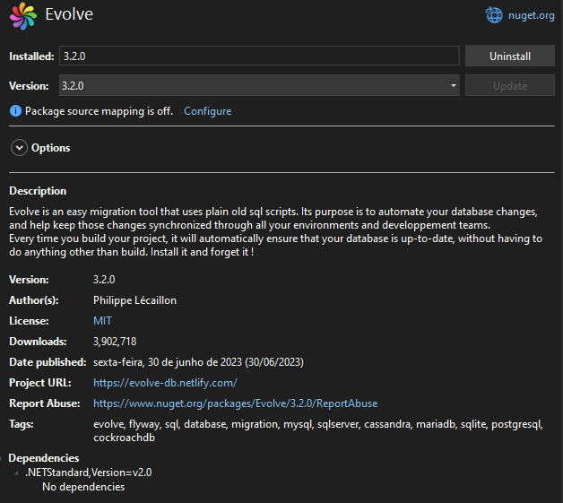
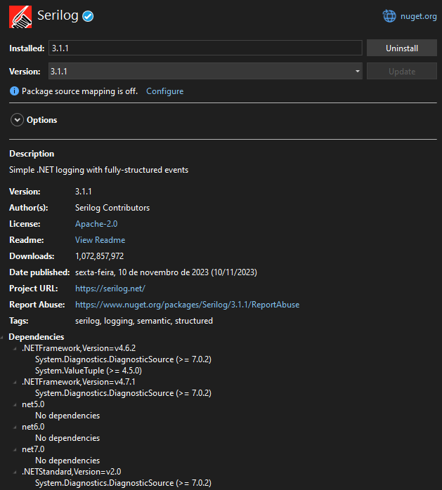
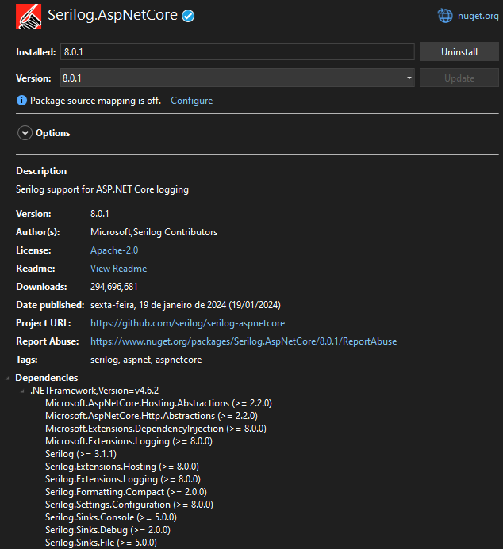
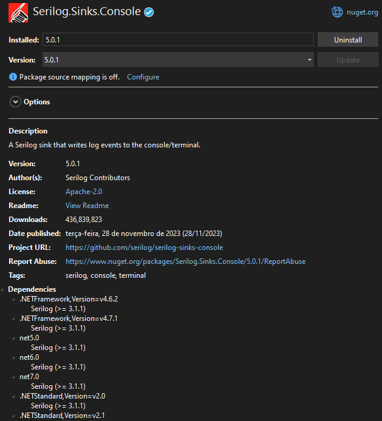
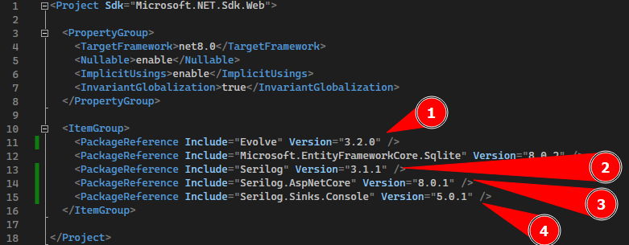
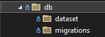

[[Página Inicial ASP_NET]]
![[R (3).png#center|200]]

```table-of-contents
```

## O que é Migration
---
**Migrações no ASP.NET** são um recurso essencial para gerenciar alterações no esquema do banco de dados em aplicativos ASP.NET.

1. **O que são Migrações?**
    
    - **Migrações** permitem que você altere o **modelo de dados** (ou seja, as classes de entidade) e aplique essas alterações ao **banco de dados** sem descartar e recriar todo o banco.
    - Antes das migrações, quando você alterava o modelo de dados, o Entity Framework descartava o banco de dados existente e criava um novo com base no novo modelo. Isso funcionava bem durante o desenvolvimento, mas não era prático em produção.
    - Com as migrações, você pode **atualizar** o esquema do banco de dados sem perder os dados existentes.
2. **Como funcionam as Migrações?**
    
    - Quando você adiciona, remove ou altera classes de entidade ou a classe `DbContext`, o Entity Framework cria uma **migração**.
    - A migração contém instruções para **atualizar** o banco de dados de acordo com as alterações no modelo.
    - Você pode aplicar a migração ao banco de dados usando comandos como `Add-Migration` e `Update-Database`.
3. **Benefícios das Migrações:**
    
    - **Flexibilidade**: Você pode iterar no modelo de dados sem medo de perder dados.
    - **Controle**: As migrações permitem que você gerencie o esquema do banco de dados de forma incremental.
    - **Implantação mais segura**: Em produção, as migrações atualizam o esquema sem descartar o banco.
4. **Como habilitar Migrações:**
    
    - No seu projeto ASP.NET, você pode usar o **Code First Migrations**.
    - Desabilite o inicializador que excluía e recriava o banco de dados automaticamente.
    - Habilite as migrações com o comando `Enable-Migrations`.

Lembre-se de que as migrações são uma prática recomendada para manter o esquema do banco de dados em sincronia com o modelo de dados, especialmente quando você implanta seu aplicativo em produção. 🚀

## Como colocar Migration no projeto
---
Agora vamos ver de implementar o Migration em nosso projeto.

### Baixando os pacotes necessários

Precisamos baixar alguns Pacotes em nosso projeto, o primeiro dele se chama __Evolve__ para lidar com o Migration em nosso projeto. Para baixar pacotes só seguir o tutorial [[Adicionando Pacotes com NuGet]].



Próximo Pacote se chama __Serilog__ para criar uma forma de Login com a aplicação.



Outro pacote é o __Serilog.AspNetCore__ que ajuda o Serilog se conectar ao ASP.NET Core.



Por fim iremos baixar o __Serilog.Sinks.Console__.



O nosso projeto deve ter os seguintes pacotes até esse momento:



### Configurando o Program.cs

Agora devemos configurar para que nosso projeto pegue as alterações que fizermos e crie uma migration, para isso iremos criar as seguintes configurações para o SQLite:

1. Coloque o seguinte código antes do __builder.build__

```csharp
/**
 * -------------------------------
 *   CONFIGURAÇÃO DE MIGRATIONS
 * -------------------------------
 * Migrations serve para controlarmos as modificações
 * do banco de dados pelo código.
 */

if (builder.Environment.IsDevelopment())
{
    if (connection != null)
	{
        MigrateDatabase(connection);
    }
}
```

2. Crie o Método __MigrateDatabase__ como mostrado abaixo:

```csharp
void MigrateDatabase(string connection)
{
	try
	{
		var evolveConnection = new SqliteConnection(connection);
		var evolve = new Evolve(evolveConnection, Log.Information)
		{
			Locations = new List<string> { "db/migrations", "db/dataset" },
			IsEraseDisabled = true,
		};
		evolve.Migrate();
	}
	catch (Exception ex)
	{
		Log.Error("Database migration failed", ex);
		throw;
	}
}
```

Esse método vai se conectar ao banco de dados usando o __Evolve__ e irá criar os migrations nas localizações _db/migrations_ e _db/dataset_.

### Criando o Database em nosso projeto

Iremos criar agora um diretório chamado __db__ e dois diretórios internos chamado __migrations__ e __dataset__ como colocado no código do Program.cs.



__dataset__ serve para colocar dados necessários e inserções de dados padrões no banco de dados.
__migrations__ são as modificações feitas no banco de dados que são salvas nesse diretório.

Seguindo a [documentação oficial do Evolve](https://evolve-db.netlify.app/configuration/naming/) temos que criar um Script com a seguinte estrutura para colocar o código SQL da nossa tabela:

```sql
V1__Create_Table_Person.sql
```

Após a versão deve ser colocados dois underlines `_` e cada parte do nome deve ser separado por um underline.

Depois criar um script em SQL que popule de dados a tabela começando com uma versão acima da versão da criação de tabelas.

```sql
V2__Populate_Table_Person.sql
```

Para isso clique na pasta __db__ com o botão direito do mouse e selecione __Add__ e depois a opção __New Item__


Coloque o nome e a extensão _.sql_ no final para criar um script SQL:


Depois de criar os dois documentos SQL, o Create Table fica no diretório __migrations__ por ser o construtor da tabela e o Populate Table por possuir dados de inserção é considerado __dataset__.

Pegue os arquivos e arraste para os devidos diretórios.


Colocamos a criação de nossa tabela, como mostrado em [[4 - SQLite Tables#Exemplo de tabela]] em nosso arquivo __V1_Create_Table_Person.sql__ 

```sql
CREATE TABLE IF NOT EXISTS persons (
	person_id INTEGER PRIMARY KEY,
	first_name TEXT NOT NULL,
	last_name TEXT NOT NULL,
	address TEXT,
	gender TEXT
);
```

Adicionamos alguns INSERTs no arquivo __V2__Populate_Table_Person.sql__ como mostrado:

```sql
INSERT INTO persons (person_id, first_name, last_name, address, gender) 
VALUES (2, 'Gabriel', 'Fanto', 'Porto Alegre', 'Male');

INSERT INTO persons (person_id, first_name, last_name, address, gender) 
VALUES (3, 'Gabriel', 'Fanto', 'Porto Alegre', 'Male');

INSERT INTO persons (person_id, first_name, last_name, address, gender) 
VALUES (4, 'Gabriel', 'Fanto', 'Porto Alegre', 'Male');

INSERT INTO persons (person_id, first_name, last_name, address, gender) 
VALUES (5, 'Gabriel', 'Fanto', 'Porto Alegre', 'Male');

INSERT INTO persons (person_id, first_name, last_name, address, gender) 
VALUES (6, 'Liliane', 'Clemente', 'Fortaleza', 'Female');
```

### Testando o Database 

Nesse momento então vamos fazer um __DROP__ do nosso banco de dados e vamos criar ele pelo nosso programa, para isso no SQLite Studio tem a opção de deletar o database:


Só por garantia, vamos deletar também o arquivo _restemplate.db_ que fica o nosso banco de dados:


Agora vamos rodar a aplicação e ele deve criar o banco de dados com os dados colocados no __dataset__.


Deu certo! além de criar o database pelo nosso programa, ele também criou uma tabela mostrando as modificações que foram feitas e quando elas ocorreram!


