[[Página Principal]]
# $$\color{lightblue}\boxed{\color{lightgreen}\sf ASP.NET}$$

---

$\sf \color{magenta}ASP.NET$ é um framework de desenvolvimento web para criarmos APIs REST no .NET com C#, ele é extremamente útil para criarmos programas avançados que podem ser usados junto com Frontends como $\sf \color{red}{Angular}$ ou $\sf \color{lightblue}{React}$. 

---
### Glossário

- [[Criando template ASPNET no Visual Studio]]
- [[Básico de REST]]
- [[Controller]]
- 
## $$\sf ROADMAP$$

```mermaid
flowchart TD
    subgraph A [ASP.NET]
        begin((inicio)) --> B
        B --> C
        C --> D
        D --> E
        E --> F
        F --> G
       
       subgraph B [LINGUAGEM E FRAMEWORK]
             basic(Básico) .- csharp(Linguagem C#)
            basic .- dotnet(Básico de .NET)
            basic .- vstudio(IDE Visual Studio)
            basic .- dotnetcli(.NET CLI)
       end
       style B fill: #000,color:#C3A8F3,stroke:#C3A8F3
       style basic fill: #000,color:#C3A8F3,stroke:#C3A8F3
       style csharp fill: #000,color:#C3A8F3,stroke:#C3A8F3
       style dotnet fill: #000,color:#C3A8F3,stroke:#C3A8F3
       style vstudio fill: #000,color:#C3A8F3,stroke:#C3A8F3
       style dotnetcli fill: #000,color:#C3A8F3,stroke:#C3A8F3

       subgraph C [BÁSICO DE DESENVOLVIMENTO]
            general(Conhecimento geral de desenvolvimento)
            general .- git(Git)
            general .- azure(Azure)
            general .- github(Github)
            general .- http(HTTP/HTTPS Protocolo)
       end
       style C fill: #000,color:#ffa500,stroke:#ffa500
       style general fill: #000,color:#ffa500,stroke:#ffa500
       style git fill: #000,color:#ffa500,stroke:#ffa500
       style azure fill: #000,color:#ffa500,stroke:#ffa500
       style github fill: #000,color:#ffa500,stroke:#ffa500
       style http fill: #000,color:#ffa500,stroke:#ffa500


       subgraph D [FUNDAMENTOS DE BANCO DE DADOS]
            db(Banco de dados) .-> sql(Básico de SQL)
            db .-> designdb(Design de banco de dados)
            db .-> proced(Procedures)
            db .-> cont(Constraint)
            db .-> trig(Triggers)
       end
       style D fill: #000,color:#29fa29,stroke:#29fa29
       style db fill: #000,color:#29fa29,stroke:#29fa29
       style sql fill: #000,color:#29fa29,stroke:#29fa29
       style designdb fill: #000,color:#29fa29,stroke:#29fa29
       style proced fill: #000,color:#29fa29,stroke:#29fa29
       style cont fill: #000,color:#29fa29,stroke:#29fa29
       style trig fill: #000,color:#29fa29,stroke:#29fa29


       subgraph E [ASP.NET CORE básico]
            aspnet(Básico para ASP.NET) .- mvc(Padrão MVC)
            aspnet .- rest(Padrão REST)
            aspnet .- razorpages(Razor Pages)
            aspnet .- razorcomp(Razor Components)
            aspnet .- mid(Middlewares)
            aspnet .- fiat(Filters e Attributes)
            aspnet .- set(App Settings e Configurations)
       end
       style E fill: #000,color:#E87CE8,stroke:#E87CE8
       style aspnet fill: #000,color:#E87CE8,stroke:#E87CE8
       style rest fill: #000,color:#E87CE8,stroke:#E87CE8
       style mvc fill: #000,color:#E87CE8,stroke:#E87CE8
       style razorpages fill: #000,color:#E87CE8,stroke:#E87CE8
       style razorcomp fill: #000,color:#E87CE8,stroke:#E87CE8
       style mid fill: #000,color:#E87CE8,stroke:#E87CE8
       style fiat fill: #000,color:#E87CE8,stroke:#E87CE8
       style set fill: #000,color:#E87CE8,stroke:#E87CE8

       subgraph F [ORM]
            orm(Object-Relational Map) .- efc(Entity Framework Core)
            orm .- dapper(Dapper)
            orm .- repodb(RepoDB)
            orm .- nhhibernate(NHibernate)
       end
       style F fill: #000,color:#B2B2FF,stroke:#B2B2FF
       style orm fill: #000,color:#B2B2FF,stroke:#B2B2FF
       style efc fill: #000,color:#B2B2FF,stroke:#B2B2FF
       style dapper fill: #000,color:#B2B2FF,stroke:#B2B2FF
       style repodb fill: #000,color:#B2B2FF,stroke:#B2B2FF
       style nhhibernate fill: #000,color:#B2B2FF,stroke:#B2B2FF  

       subgraph G [INJEÇÃO DE DEPENDÊNCIAS]
            inj(Dependency Injection) .- dicon(DI Container)
            inj .- scrutor(Scrutor)
            inj .- lifecy(Life Cycles)
            lifecy .- scoped(Scoped)
            lifecy .- transient(Transient)
            lifecy .- sing(Singleton)
       end
       style G fill: #000,color:#ff0000,stroke:#ff0000
       style inj fill: #000,color:#ff0000,stroke:#ff0000
       style dicon fill: #000,color:#ff0000,stroke:#ff0000
       style scrutor fill: #000,color:#ff0000,stroke:#ff0000
       style lifecy fill: #000,color:#ff0000,stroke:#ff0000
       style scoped fill: #000,color:#ff0000,stroke:#ff0000
       style transient fill: #000,color:#ff0000,stroke:#ff0000
       style sing fill: #000,color:#ff0000,stroke:#ff0000

    end
    style A fill: #000,color:#fff,stroke:#fff
    style begin fill: #000,color:#fff,stroke:#fff
```

