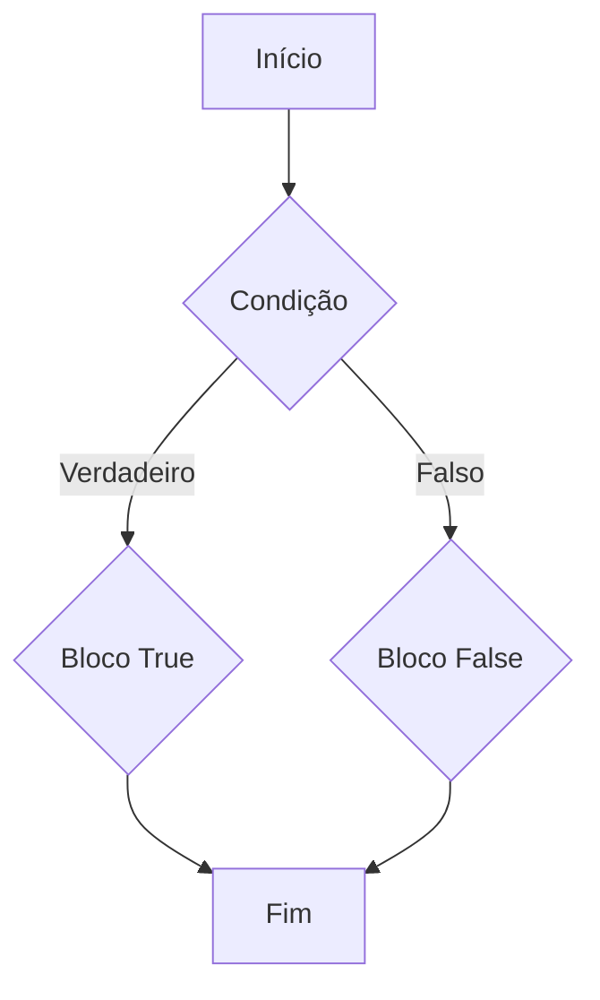

# $$\boxed{\mathbb{\color{orange}IF-ELSE}}$$

<p align="center">
    
</p>

---

## O que é IF-ELSE

If-else é uma $\sf \color{orange} estrutura \space de \space controle \space de \space fluxo$ em C# e em outras linguagens de programação que permite que um programa execute um bloco de código se uma determinada condição for verdadeira e execute um bloco de código diferente se a condição for falsa. A sintaxe básica do if-else em C# é:

```csharp
if (condição)
{
    // bloco de código que será executado se a condição for verdadeira
}
else
{
    // bloco de código que será executado se a condição for falsa
}
```

A `condição` é uma expressão booleana que retorna `true` ou `false`. Se a condição for `true`, o bloco de código dentro do `if` será executado. Se a condição for `false`, o bloco de código dentro do `else` será executado.

O if-else pode ser usado em várias situações, como validação de entrada do usuário, verificação de condições em tempo de execução e tomada de decisões com base em resultados de cálculos. A estrutura if-else é uma das construções fundamentais de programação em C# e em outras linguagens de programação.


