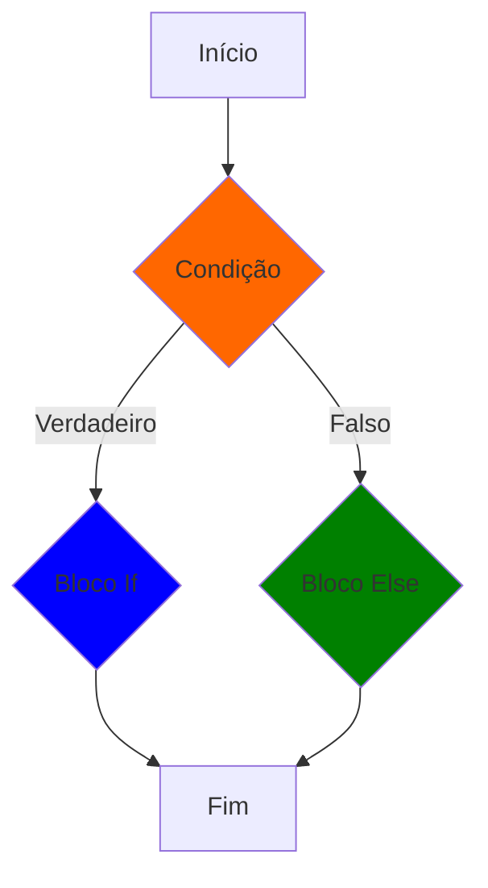

# $$\boxed{\mathbb{\color{orange}IF-ELSE}}$$

<p align="center">
    
</p>

---

- [O que é IF-ELSE](#o-que-é-if-else)
- [Operadores de Comparação](#operadores-de-comparação)
- [Criando um IF](#criando-um-if)
- [Verificação de valores nulos](#verificação-de-valores-nulos)
- [Operadores lógicos](#operadores-lógicos)
    - [Operador AND(&&)](#operador-and)
    - [Operador OR(||)](#operador-or)
    - [Operador NOT(!)](#operador-not)
- [Criando um ELSE](#criando-um-else)
- [Criando múltiplos blocos](#criando-multiplos-blocos)
- [IF ternário](#if-ternário)
- [Verificação de strings](#verificação-de-strings)
    - [Equals](#equals)
    - [Compare](#compare)
    - [Contains](#contains)
    - [StartsWith e EndsWith](#startswith-e-endswith)

---

## O que é IF-ELSE

If-else é uma $\sf \color{orange} estrutura \space de \space controle \space de \space fluxo$ em C# e em outras linguagens de programação que permite que um programa execute um bloco de código se uma determinada condição for verdadeira e execute um bloco de código diferente se a condição for falsa. A sintaxe básica do if-else em C# é:

```csharp
if (condição)
{
    // bloco de código que será executado se a condição for verdadeira
}
else
{
    // bloco de código que será executado se a condição for falsa
}
```

A `condição` é uma expressão booleana que retorna `true` ou `false`. Se a condição for `true`, o bloco de código dentro do `if` será executado. Se a condição for `false`, o bloco de código dentro do `else` será executado.

O if-else pode ser usado em várias situações, como validação de entrada do usuário, verificação de condições em tempo de execução e tomada de decisões com base em resultados de cálculos. A estrutura if-else é uma das construções fundamentais de programação em C# e em outras linguagens de programação.



---

## Operadores de comparação

Operadores de comparação são utilizados para fazermos verificações de lógica computacional, essas verificações retornam valores $\sf \color{orange}Booleanos$ de Verdadeiro ($\sf \color{magenta} True$) ou Falso ($\sf \color{magenta} False$).

* Temos os seguintes operadores de comparação:

Simbolo|Nome|Exemplo teórico|Exemplo em código
|---|---|---|---|
|$\sf \color{lightgreen}==$|Igual a|5 é igual a 5|`5 == 5`
|$\sf \color{lightgreen}!=$|Diferente de|5 é diferente de 6|`5 != 6`
|$\sf \color{lightgreen}>$|Maior que|6 é maior que 5|`6 > 5`
|$\sf \color{lightgreen}<$|Menor que|5 é menor que 6|`5 < 6`
|$\sf \color{lightgreen}>=$|Maior ou igual a|6 é maior ou igual a 5|`6 >= 5`
|$\sf \color{lightgreen}<=$|Menor ou igual a|5 é menor ou igual a 6|`5 <= 6`

Exemplos:

```csharp
3 == 3 // True
3 != 4 // True
5 > 3 // True
3 < 5 // True
5 >= 5 // True
5 >= 3 // True
3 <= 3 // True
3 <= 5 // True
```

---

## Criando um IF

If é uma instrução na programação que ativa uma área do código quando a condição utilizando os operadores de comparação retorne o valor booleano $\sf \color{magenta} True$.

```csharp
int x = 5;
int y = 5;

if (x == y) 
{
    // bloco de código
}
```

No exemplo acima o bloco de código só vai ser feito se o valor da variável x for igual ao valor da variável y, onde a operação $\sf \color{lightblue}x == y$ deve ter resultado booleano $\sf \color{magenta} True$.

Caso os valores não sejam iguais, ele nem acessa o bloco interno.

```csharp
int x = 5;
int y = 6;

if (x == y) 
{
    // Aqui não é acessado
}
```

---

## Verificação de valores nulos

Com os operadores de comparação podemos verificar se uma variável é nula ou não, isso é muito útil para evitar que valores nulos sigam em frente no código.

Para isso usamos a comparação $\sf \color{magenta}!=$ comparando com o objeto $\sf \color{lightblue}null$:

```csharp
int value = 1;

if (value != null) 
{
    Console.WriteLine("Valor não é nulo");
}
```

---

## Operadores Lógicos

* Podemos fazer verificações lógicas no IF utilizando lógica matemática, utilizando operadores lógicos conhecidos como AND,OR,NOT:
* Na linguagem C# o AND é utilizado o Símbolo $\sf \color{magenta}\&\&$
* Na linguagem C# o OR é utilizado o Símbolo $\sf \color{magenta} \|\|$
* Na linguagem C# o NOT é utilizando o Símbolo $\sf \color{magenta} !$

Abaixo a tabela verdade com os retornos booleanos possíveis no IF

### Operador AND (&&)

| A     | B     | A && B |
|-------|-------|--------|
| true  | true  | true   |
| true  | false | false  |
| false | true  | false  |
| false | false | false  |

### Operador OR (||)

| A     | B     | A \|\| B |
|-------|-------|----------|
| true  | true  | true     |
| true  | false | true     |
| false | true  | true     |
| false | false | false    |

### Operador NOT (!)

| A     | !A    |
|-------|-------|
| true  | false |
| false | true  |

Exemplos de códigos:

A) Verificando se o valor não é nulo e se é maior que 1:

```csharp
int value = 1;

if (value == 1 && value >= 1) 
{
    Console.WriteLine("Entrou aqui!");
}
```

B) Verificando se o valor é diferente de nulo ou se o valor é falso:

```csharp
bool value = false;

if (value == true || !value)
{
    Console.WriteLine("Acessou Aqui!");
}
```

---

## Criando um Else

Else é uma instrução que será somente ativa se a instrução If tiver a condição de operador dado o resultado $\sf \color{magenta} False$.

Ele serve principalmente para ativar um bloco de código caso falhe a verificação do IF.

```csharp
int x = 5;
int y = 6;

if (x == y) 
{
    Console.WriteLine("Entrou no IF");
} else 
{
    Console.WriteLine("Entrou no ELSE");
}

// Saída: Entrou no ELSE
```

## Criando multiplos blocos

Podemos construir multiplos blocos dentro do IF-ELSE utilizando o $\sf \color{orange}else \space if()$, que serve para fazer outras verificações utilizando lógica de programação com operadores de comparação.

```csharp
int x = 5;
int y = 6;

if (x == y)
{
    Console.WriteLine($"{x} é igual a {y}");
}
else if (x != y)
{
    Console.WriteLine($"{x} é diferente de {y}");
}
else {
    Console.WriteLine("Caiu no bloco do ELSE");
}

//Saída: 5 é diferente de 6
```

---

## IF ternário

Quando temos uma condição simples de IF-ELSE não precisamos construir toda uma estrutura para isso, podemos utilizar uma única linha de código utilizando a seguinte sintaxe:

```csharp
(condicao) ? valorTrue : valorFalse;
```

Com essa estrutura podemos fazer uma verificação de condição sem precisar utilizar muito do código, só fique atento que se o seu IF-ELSE tiver várias condições essa estrutura não é uma boa ideia de utilizar, podendo prejudicar o entendimento do código.

* IF-ELSE padrão

```csharp
int x = 5;
int y = 6;
string mensagem;

if (x == y) 
{
    mensagem = "Entrou no IF";
}
else 
{
    mensagem = "Entrou no ELSE";
}

Console.WriteLine(mensagem);
// Saída: Entrou no ELSE
```

* IF Ternário

```csharp
int x = 5;
int y = 6;
string mensagem = (x == y) ? "Entrou no IF" : "Entrou no ELSE";
Console.WriteLine(mensagem);
// Saída: Entrou no ELSE
```

---

## Verificação de strings

Podemos verificar strings e caracteres também para entrarmos em blocos do IF-ELSE,mas ele funciona diferente do que da matemática, onde não usamos os operadores para verificar e sim métodos prontos que nos auxiliam nesse processo.

Os métodos mais usados são os seguintes.

### Equals

$\sf \color{magenta}Equals(string)$: compara duas strings e retorna True se elas tiverem o mesmo conteúdo e a mesma capitalização (se os caracteres também estão da mesma forma)

```csharp
string text1 = "Teste";
string text2 = "Teste";

if (text1.Equals(text2))
{
    // Vai entrar aqui
}
```

No exemplo acima ele vai acessar a área do IF devido que as duas strings são idênticas, tanto em texto quanto as letras maiusculas, mas e se não fosse o caso?

```csharp
string text1 = "Teste";
string text2 = "teste";

if (text1.Equals(text2))
{
    // Não vai entrar aqui
}
```

Por ter a primeira letra minuscula no `text2` as duas strings não são iguais, mas podemos fazer o sistema ignorar isso utilizando o parâmetro opcional $\sf \color{orange} StringComparison.CurrentCultureIgnoreCase$ como um atributo dentro do método $\sf \color{magenta} Equals$.

```csharp
string text1 = "Teste";
string text2 = "teste";

if (text1.Equals(text2, StringComparison.CurrentCultureIgnoreCase))
{
    // Vai entrar aqui
}
```

Com isso, ele continua verificando se o texto é igual mas vai ignorar se tem letras maiusculas.

### Compare

$\sf \color{magenta}Compare(str1, str2)$ compara duas Strings e retorna um valor inteiro que indica a relação de ordenação entre as Strings, esse valor retornado pode ser usado para determinar se as strings são iguais, se uma é maior que a outra ou se são equivalentes em ordenação alfabética.

```csharp
string text1 = "teste";
string text2 = "teste";

if (String.compare(text1, text2) == 0) {
    // vai acessar esse bloco
}
```

$\sf \color{orange}String$ com S maiusculo é o nome da classe que tem métodos para interagir com strings em C#, onde possui o método `compare` como um deles.

Assim como o Equals, podemos usar o parâmetro opcional $\sf \color{orange} StringComparison.CurrentCultureIgnoreCase$ para ignorar se tem letras maiusculas ou minusculas diferente entre eles.

```csharp
string text1 = "Teste";
string text2 = "teste";

if (String.compare(text1, text2, StringComparison.CurrentCultureIgnoreCase) == 0) {
    // vai acessar esse bloco
}
```

O resultados possíveis do método Compare são:
* $\sf \color{lightgreen} Valor \space negativo$: primeira string é menor que a segunda.
* $\sf \color{lightgreen} Zero$: as duas strings são iguais.
* $\sf \color{lightgreen} Valor \space positivo$: primeira string é maior que a segunda.

### Contains

$\sf \color{magenta}Contains(str)$ é um método para verificar se na nossa string tem uma palavra específica, onde esse método retorna um valor booleano.

```csharp
string text = "Hello World";

if (text.Contains("World")) {
    // vai acessar esse bloco
}
```

Nesse método ele vai procurar no texto a palavra `World` onde nesse caso ela precisa ser exatamente como deve estar dentro da string.

Assim como todos os outros métodos, podemos usar o parâmetro opcional $\sf \color{orange} StringComparison.CurrentCultureIgnoreCase$ para procurar a string ignorando se tem letra maiuscula ou minuscula.

```csharp
string text = "Hello World";

if (text.Contains("world", StringComparison.CurrentCultureIgnoreCase)) {
    // vai acessar esse bloco
}
```

### StartsWith e EndsWith

$\sf \color{magenta}StartsWith(str)$ verifica se a string inicia com uma string específica, caso inicie, o método retorna True.

$\sf \color{magenta}EndsWith(str)$ verifica se a string finaliza com uma string específica, caso finalize, o método retorna True.

```csharp
string str1 = "Hello World";

if (str1.StartsWith("Hello"))
{
    Console.WriteLine("A string começa com 'Hello'");
}

if (str1.EndsWith("World"))
{
    Console.WriteLine("A string termina com 'World'");
}
```

Esses dois métodos verificam se a palavra é identica, se não tiver com todos os caracteres identicos ele retorna False.

Para verificar sem se preocupar se tem diferenças entre maiuscula e minuscula, usamos o parâmetro opcional $\sf \color{orange} StringComparison.CurrentCultureIgnoreCase$

```csharp
string str1 = "Hello World";

if (str1.StartsWith("hello", StringComparison.CurrentCultureIgnoreCase))
{
    Console.WriteLine("A string começa com 'Hello'");
}

if (str1.EndsWith("world", StringComparison.CurrentCultureIgnoreCase))
{
    Console.WriteLine("A string termina com 'World'");
}
```
