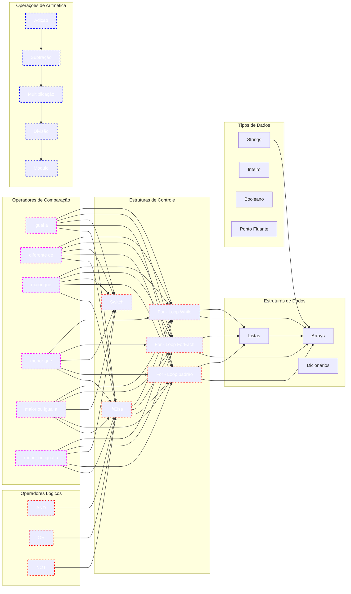

# $$\boxed{\mathbb{BÁSICO \space DE \space CSHARP}}$$

    

---

## $$\sf Glossário$$

- [Hello World](HelloWorld/README.md)
- [Entrada e Saída](In_Out/README.md)
- [Matemática](Matematica/README.md)
- [If-Else](IfElse/README.md)

---

## Roadmap

