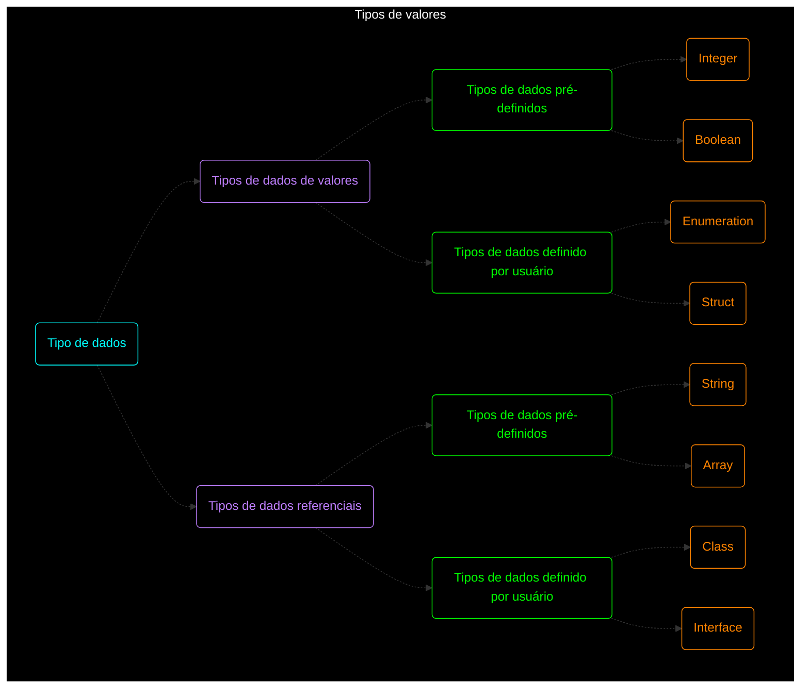
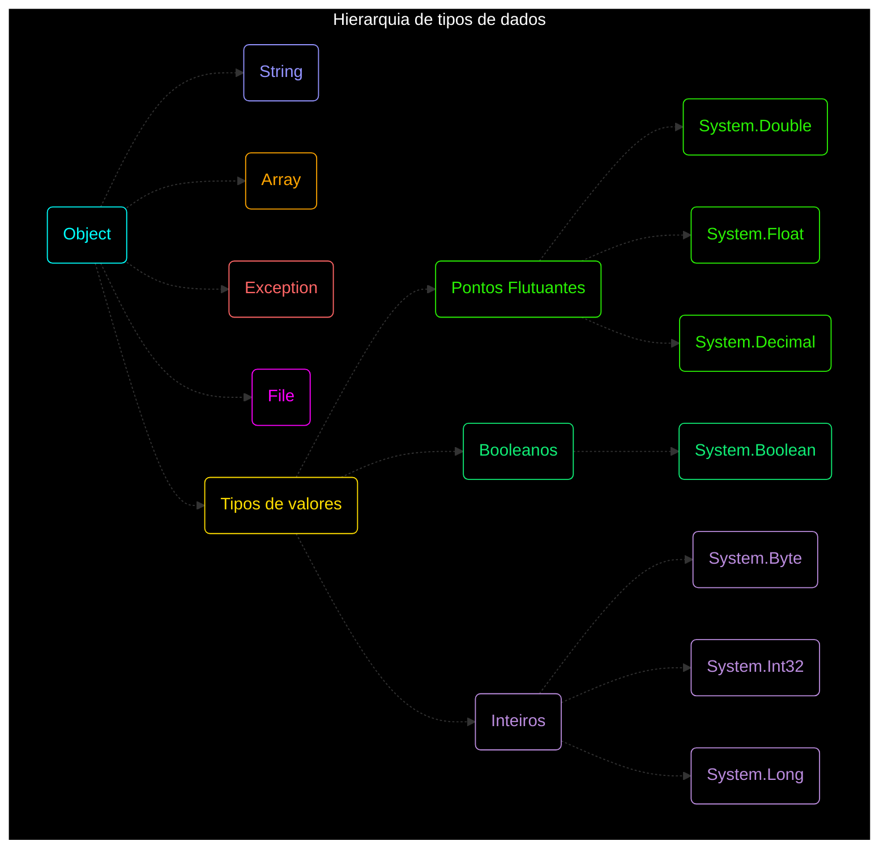

# $$\boxed{\sf TIPOS \space DE \space DADOS}$$

<p align="center">
    
</p>

---

- [$$\\boxed{\\sf TIPOS \\space DE \\space DADOS}$$](#boxedsf-tipos-space-de-space-dados)
	- [Tipos de dados](#tipos-de-dados)
		- [Tipos de dados de referência e de valor](#tipos-de-dados-de-referência-e-de-valor)
		- [Tipos de valor](#tipos-de-valor)
		- [Tipos de referência](#tipos-de-referência)
	- [Hierarquia de tipos de dados](#hierarquia-de-tipos-de-dados)
	- [Backing Types](#backing-types)
	- [Utilizando tipos de dados básicos do C#](#utilizando-tipos-de-dados-básicos-do-c)
		- [Booleanos](#booleanos)
		- [Inteiros](#inteiros)
		- [Pontos Flutuantes](#pontos-flutuantes)
		- [Caracteres](#caracteres)
	- [Utilizando DateTime](#utilizando-datetime)
	- [Convertendo o tipos de dados](#convertendo-o-tipos-de-dados)
	- [Tipo implicito](#tipo-implicito)
		- [Uso de var em C#](#uso-de-var-em-c)
		- [Exemplos de uso de var](#exemplos-de-uso-de-var)
	- [Strings](#strings)
	- [Utilizando Parse](#utilizando-parse)

---

C# é uma linguagem super tipada, precisa dizer exatamente qual tipo de cada variável.

Com tipos de dados dizemos qual o tamanho necessário de memória necessária para uma variável

Todo tipo de dados possuem um valor minimo e máximo.

Todo tipo de dados podem ter um valor retornado.

- $\sf \color{magenta}bool$ = Guarda valores booleanos (true ou false)
- $\sf \color{magenta}int$ = Guarda valores inteiros (1, 2, 3, 543, 10000)
- $\sf \color{magenta}float/double/decimal$ = Guarda valores de pontos flutuantes (1,.5, 2.34, 33.33333)
- $\sf \color{magenta}char$ = Guarda um caractere
- $\sf \color{magenta}byte$ = Guarda 8 bit
- $\sf \color{magenta}object$ = Guarda um objeto, isso será visto mais para frente.
- $\sf \color{magenta}string$ = guarda um conjunto de caracteres, que se tornam uma palavra, separado com `“ ”`

```csharp
bool valorBool = true;
int valorInt = 10;
float valorFloat = 10.0f;
double valorDouble = 10.0;
decimal valorDecimal = 10.0m;
char valorChar = 'a';
byte valorByte = 10;
object valorObject = "10";
string valorString = "10";
```

## Tipos de dados

### Tipos de dados de referência e de valor

Os tipos de dados em C# podem ser divididos em dois tipos: tipos de valor e tipos de referência.

### Tipos de valor

Os tipos de valor, como $\sf \color{magenta}int$, $\sf \color{magenta}float$ e $\sf \color{magenta}bool$, são tipos que armazenam diretamente o valor em uma variável. Quando uma variável é definida como um tipo de valor, um espaço na memória é alocado para armazenar o valor. Os tipos de valor são armazenados na pilha.

### Tipos de referência

Os tipos de referência, como $\sf \color{magenta}string$ e $\sf \color{magenta}object$, armazenam um ponteiro para um objeto na memória. Quando uma variável é definida como um tipo de referência, um espaço na memória é alocado para armazenar o ponteiro para o objeto. O objeto real é armazenado em outro lugar na memória e pode ser compartilhado por várias variáveis. Os tipos de referência são armazenados no heap.

Os tipos de valor são geralmente mais eficientes em termos de desempenho do que os tipos de referência, pois eles não exigem alocar e desalocar memória dinamicamente. No entanto, os tipos de referência são mais flexíveis e podem ser usados para representar objetos complexos e estruturas de dados.



## Hierarquia de tipos de dados

A hierarquia de tipos de dados no C# começa com o tipo $\sf \color{magenta}object$, que é a raiz da hierarquia. Todos os outros tipos de dados são derivados desse tipo. Abaixo de $\sf \color{magenta}object$ estão os tipos de valor e os tipos de referência. Os tipos de valor, como $\sf \color{magenta}int$, $\sf \color{magenta}float$, $\sf \color{magenta}double$, etc., são armazenados diretamente na memória, enquanto os tipos de referência, como $\sf \color{magenta}string$, $\sf \color{magenta}object$, etc., são armazenados em outra parte da memória e referenciados por um ponteiro. Além disso, existem os $\sf \color{magenta}Backing Types$, que são os tipos subjacentes que suportam as propriedades de um tipo de dados. Essa hierarquia é exemplificada pelo diagrama abaixo:



## Backing Types

**Backing Types** são os tipos de dados subjacentes que suportam as propriedades de um tipo de dados. Por exemplo, a propriedade $\sf \color{magenta}int$ é suportada pelo tipo subjacente $\sf \color{magenta}System.Int32$. O tipo subjacente pode ser acessado usando a palavra-chave $\sf \color{magenta}typeof$.

Tipo primitivo|Backing Type
|---|---|
int|Int32
float|Float
decimal|Decimal
bool|Boolean
byte|Byte

```csharp

```

## Utilizando tipos de dados básicos do C#

---

### Booleanos

- para guardarmos booleanos precisamos construir uma variável do tipo `bool`
- Podemos guardar um valor ou podemos utilizar uma ******************expressão****************** para salvar esse valor, como nos exemplos abaixo

```csharp
bool value1 = true; // Salvar um tipo booleano direto na variável

bool value2 = 3 == 4; // Cria uma expresão que retorna um valor booleano 
```

### Inteiros

- Para guardarmos inteiros precisamos construir uma variável do tipo `int`
- Podemos guardar um valor ou podemos utilizar uma **expressão** para salvar esse valor, como nos exemplos abaixo

```csharp
int value1 = 3; // Salvar um valor inteiro direto na variável

int value2 = 4 + 5; // Criar uma expressão que retorna um valor inteiro
```

### Pontos Flutuantes

- Tem 3 principais tipos de pontos flutuantes: `float` , `double` , `decimal`
- A principal diferença entre eles é o tamanho máximo de digitos que podem ser usados, o `decimal`possui o maior tamanho máximo de uso
- Para guardarmos pontos flutuantes, podemos guardar um valor direto ou podemos utilizar uma **expressão** para salvar esse valor, como nos exemplos abaixos

```csharp
float value1 = 1.2; // float direto na variável
float value2 = 2/3; // expressão que retorna um float

double value3 = 1.3333; // double direto na variável
double value4 = 2/3; // expressão que retorna um double

decimal value5 = 1.3333333; // decimal direto na variável
decimal value6 = 2/3; // expressão que retorna um decimal
```

### Caracteres

- Caractere são salvos no tipo `char`
- Podemos fazer verificações com caracteres, usando métodos existentes do C#

```csharp
char myChar = 'a'; // caractere direto na varivável

bool isSpace = char.IsWhiteSpace(myChar); // verifica se é um espaço em branco
bool isDigit = char.IsDigit(myChar); // verifica se é um número
bool isPuntuation = char.IsPunctuation(myChar); // verifica se é um acento
```

## Utilizando DateTime

---

Datetime é um tipo de dado objeto para construir tipos de datas.

- Aqui alguns exemplos de uso do Datetime

```csharp
DateTime data1 = new DateTime(2023,05,04); // ano, mes, dia
DateTime hoje = DateTime.Today; // pega o dia de hoje
DateTime doisDiasDepois = data1.AddDays(2); // dois dias depois da data inicial
DayOfWeek dia = data1.DayOfWeek; // pega o dia da semana da data inicial
bool isDST = data1.IsDaylightSavingTime(); // verifica se é dia
```

- Podemos colocar a data de uma forma mais simples de leitura, utilizando `TimeSpan`
1. Vamos criar uma data e vamos imprimir a data de forma visual e o horário dela

```csharp
DateTime agora = DateTime.Now;
Console.WriteLine(agora.ToLongDateString()); // Apresenta o dia de forma visual
Console.WriteLine(agora.ToShortTimeString()); // Apresenta a hora de forma visual
```

## Convertendo o tipos de dados

---

Em C# podemos usar o $\sf \color{magenta}cast$ para trocar o tipo do dado salvando em uma nova variável.

```csharp
double value = 3.25;
int newValue = (int)value;
Console.WriteLine(value); // 3.25
Console.WriteLine(newValue); // 3
```

Podemos fazer cast de qualquer tipo primitivo:

Tipo de cast| O que faz
|---|---|
($\sf \color{lightblue}int$)| Transforma em inteiro
($\sf \color{lightblue}double$)| Transforma em double
($\sf \color{lightblue}decimal$)| Transforma em decimal
($\sf \color{lightblue}float$)| Transforma em float
($\sf \color{lightblue}boolean$)| Transforma em booleano

## Tipo implicito

---

### Uso de var em C#

Em C#, podemos usar o operador "var" para declarar variáveis com tipos implicitamente. Quando usamos "var", o compilador infere o tipo da variável com base no valor que a variável recebe. Por exemplo:

```csharp
var nome = "João"; // o tipo da variável é inferido como string
var idade = 30; // o tipo da variável é inferido como int
var dataNascimento = new DateTime(1980, 1, 1); // o tipo da variável é inferido como DateTime

```

O uso de "var" pode tornar nosso código mais conciso e legível, especialmente quando o tipo da variável é óbvio a partir do valor que a variável recebe.

### Exemplos de uso de var

Aqui estão alguns exemplos de uso de "var":

```csharp
var listaNomes = new List<string>(); // declara uma lista de nomes

var resultado = 2 + 2; // declara uma variável para armazenar o resultado da operação

var cliente = new { Nome = "Maria", Idade = 25 }; // declara um objeto anônimo para armazenar informações do cliente

var numeros = new int[] { 1, 2, 3, 4, 5 }; // declara uma matriz de inteiros

var hoje = DateTime.Today; // declara uma variável para armazenar a data de hoje

```

Em geral, devemos usar "var" quando o tipo da variável é óbvio a partir do valor que a variável recebe. No entanto, também é importante lembrar que o uso excessivo de "var" pode tornar nosso código menos legível, especialmente quando o tipo da variável não é óbvio a partir do valor que a variável recebe.


## Strings

---

Strings são um tipo de dado muito utilizado na programação, é um conjunto de caracteres concatenados que criam uma palavra ou frase.

Em C# temos o tipo de dado chamado `string` com S minusculo, quando é Maiusculo é a classe `String` do System.

Os valores de uma string devem estar dentro de `""` para ser identificado como string.

Formas de criar um string em C#

```csharp
string s1 = "Hello World"; //string normal
string s2 = string.Empty; // para identificar como string vazia
var s3 = "This is a string"; //variável var que reconhece o dado como string
string s4 = null; //variável de string nula
string s5; //variável de string somente inicializada (sem valor ainda)
```

Podemos usar certas funções que irão nos ajudar a mexer com os valores de uma string, como as abaixo:

```csharp
// strings criadas
string teste = "Hello World";
string teste2 = " Matilda";

// Pegando informações de uma String
int tamanho = teste.Length; // pega o tamanho da string
string maiusculas = teste.ToUpper(); // poem todas as letras maiusculas
string minusculas = trste.ToLower(); //poem todas as letras minusculas
bool possui = teste.Contains("Hello"); //verifica se tem a palavra Hello
string troca = teste.Replace("a","b"); //troca as letras na string
string sub = teste.Substring(1,3); //pega uma parte da string original
```

Podemos utilizar a classe String do System para podermos interagir mais fortemente com mais de uma String aos mesmo tempo.

```csharp
/*
* Concatena duas Strings juntas
*/
string novaString = String.Concat(teste,teste2);

/*
* Formata um texto chamando as Strings e criando uma nova
*/ 
string formatacao = String.Format("{0} {1}! Good day", teste, teste2); 
```

## Utilizando Parse

---

A função `Parse` é usada para converter uma string em um valor de um tipo de dados específico. Por exemplo, se tivermos uma string que representa um número inteiro, podemos usar `int.Parse` para converter essa string em um valor inteiro. Se a conversão não for possível, uma exceção será lançada.

Aqui está um exemplo de uso de `Parse` para converter uma string em um valor inteiro:

```csharp
string numero = "42";
int valor = int.Parse(numero);

```

Aqui está um exemplo de uso de `Parse` para converter uma string em um valor de ponto flutuante:

```csharp
string numero = "3.14";
float valor = float.Parse(numero);

```

Se a string não puder ser convertida em um valor do tipo de dados especificado, uma exceção será lançada. Por exemplo, se tentarmos converter uma string que não representa um número em um valor inteiro, uma exceção `FormatException` será lançada:

```csharp
string texto = "hello";
int valor = int.Parse(texto); // Vai lançar uma exceção FormatException
```

