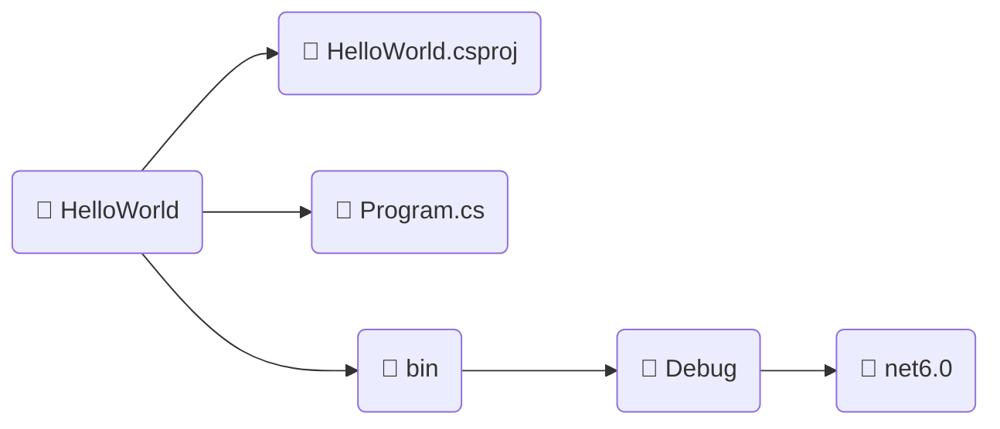
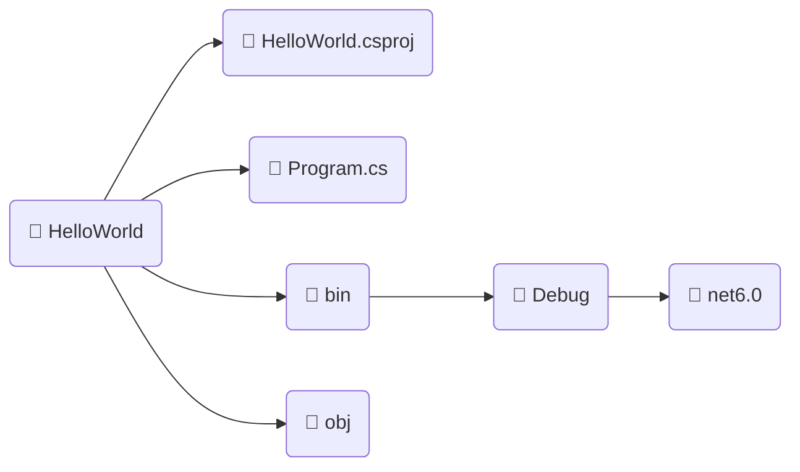

[[Página Principal]]

---

#### $$\mathbb{CONTEÚDO}$$

- [[Básico de Csharp]]
---

- [Como começar a desenvolver em C#](#como-começar-a-desenvolver-em-c)
    - [Arquivos gerados](#arquivos-gerados)
    - [Compilando o projeto](#compilando-o-projeto)
- [O que é C#](#o-que-é-c)

## Como começar a desenvolver em C#

Para programar em C# é necessário o .NET SDK, é com ele que podemos construir projetos .NET chamado de `Console Project` para compilar programas em C#.

Rode o seguinte comando dentro de um diretório chamado `HelloWorld`

```powershell
dotnet new console
```


Ele vai criar um projeto do tipo `console` com o nome do diretório que foi rodado esse comando.

---

### Arquivos gerados



* $\color{magenta}\sf HelloWorld.csproj$ : Este é o arquivo de projeto do C# (**cs**harp **proj**ect) onde ficam as configurações e dependências para o projeto.
* $\color{magenta}\sf Program.cs$ : Este é o arquivo (incialmente começa com o nome Program, mas pode ser renomeado) onde iremos colocar nosso código C#.
* $\color{lightgreen}\sf bin/Debug/net6.0$ : É um diretório com os binários do programa, com arquivos necessários para o processo de tradução do programa para ser compilado.

---

### Compilando o projeto

Dentro do diretório criado chamado `HelloWorld` com o projeto e o arquivo C# deve ser rodado o seguinte comando:

```powershell
dotnet run
```

Com esse comando ele vai compilar o arquivo `Program.cs` e apresentar no console o resultado do programa.

Além disso ele vai criar um diretório chamado  $\color{magenta}\sf obj$ com os arquivos da compilação feita pelo .NET

No Fim o Projeto vai ficar estruturado da seguinte forma:



Esta é a estrutura básica de um programa do tipo console gerado pelo .NET para compilarmos programas em C#.

---

## O que é essa linguagem?

C# é uma $\sf \color{orange} linguagem \space de \space programação \space orientada \space a \space objetos$ criada pela Microsoft em **2000**. 

É uma linguagem de $\sf \color{lightblue} alto \space nível$, fortemente tipada e compilada, projetada para ser **simples**, **moderna** e **segura**. 

C# é amplamente utilizado para desenvolvimento de software em plataforma Microsoft, incluindo **aplicações Windows**, **aplicativos web**, **jogos** e **dispositivos móveis**.

Aqui estão algumas informações técnicas essenciais sobre a linguagem C#:

- $\sf \color{magenta} Tipagem \space forte$: C# é uma linguagem de programação que deve seguir fortemente a nomenclatura usando CamelCase (primeira letra é sempre maiuscula de cada palavra: WriteLine), o que significa que os tipos de dados são estritamente verificados durante a compilação. Isso ajuda a evitar erros de programação e a melhorar a segurança do software.

- $\sf \color{magenta} Orientada \space a \space objetos$: C# é uma linguagem de programação orientada a objetos, o que significa que tudo é tratado como um objeto. Isso inclui tipos primitivos como inteiros e booleanos, bem como objetos mais complexos como classes e estruturas.

- $\sf \color{magenta}Compilada$: C# é uma linguagem de programação compilada, o que significa que o código-fonte é convertido em código de máquina antes da execução. Isso ajuda a melhorar a eficiência do programa e a evitar erros de sintaxe durante a execução.

- $\sf \color{magenta}Plataforma \space Microsoft$: C# é uma linguagem de programação desenvolvida pela Microsoft e é amplamente utilizada para desenvolvimento de software em plataforma Microsoft. Isso inclui aplicativos Windows, aplicativos web usando o ASP.NET, jogos usando o Unity e dispositivos móveis usando o Xamarin.

- $\sf \color{magenta} Bibliotecas \space de \space classe$: C# tem uma ampla variedade de bibliotecas de classe que ajudam a simplificar o desenvolvimento de software. Isso inclui bibliotecas para trabalhar com entrada e saída, gráficos, redes, segurança e muito mais.

- $\sf \color{magenta} Suporte \space a \space LINQ$: C# oferece suporte a Language Integrated Query (LINQ), que permite que os desenvolvedores consultem dados de forma fácil e eficiente em várias fontes de dados, incluindo bancos de dados, coleções de objetos e arquivos XML.

- $\sf \color{magenta} Gerenciamento \space de \space memória$: C# tem um sistema de gerenciamento de memória automático, que ajuda a evitar erros comuns de programação, como vazamentos de memória.

- $\sf \color{magenta} Sintaxe \space simples \space e \space legível$: C# tem uma sintaxe simples e legível, que é fácil de aprender e usar. Isso ajuda a melhorar a produtividade do desenvolvedor e a reduzir o tempo de desenvolvimento.