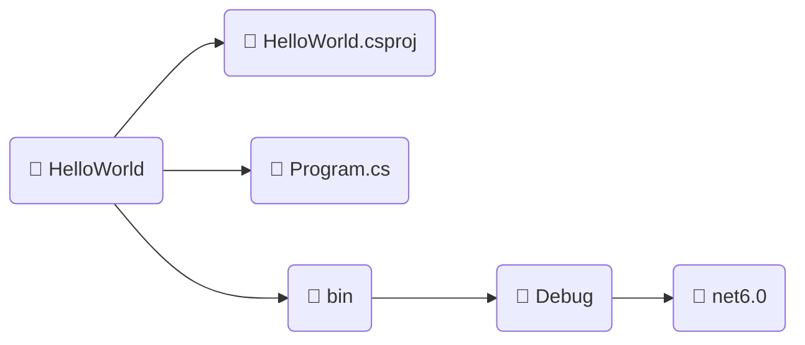
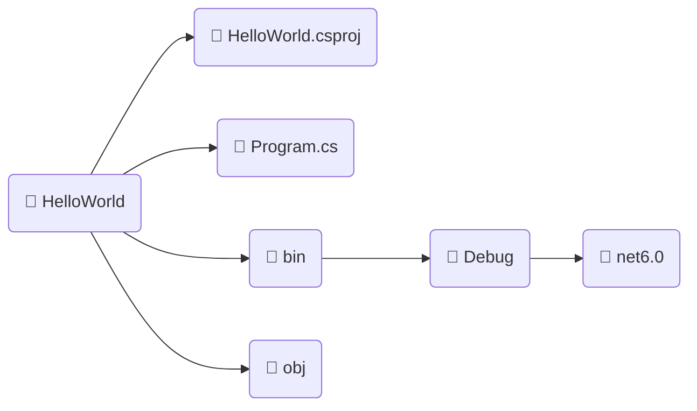

# $$\boxed{\color{magenta}\mathbb{C\text{\#}}}$$

<p align="center">
    
</p>
<p align="center">Linguagem de Programação criada pela Microsoft em 2001</p>

---

#### $$\mathbb{CONTEÚDO}$$

- [Programação Básica de C#](/C%23/Basico/README.md)
- [Algoritmos em C#](/C%23/Algoritmos/README.md)
- [Orientação a Objetos em C#](/C%23/Orientacao-Objetos/README.md)
- [Clean Code em C# [EM CONTRUÇÃO]]()
- [LINQ [EM CONSTRUÇÃO]]()
- [Exemplos [EM CONSTRUÇÃO]]()

---

## Como começar a desenvolver em C#

Para programar em C# é necessário o .NET SDK, é com ele que podemos construir projetos .NET chamado de `Console Project` para compilar programas em C#.

Rode o seguinte comando dentro de um diretório chamado `HelloWorld`

```powershell
dotnet new console
```


Ele vai criar um projeto do tipo `console` com o nome do diretório que foi rodado esse comando.

---

## Arquivos gerados



* $\color{magenta}\sf HelloWorld.csproj$ : Este é o arquivo de projeto do C# (**cs**harp **proj**ect) onde ficam as configurações e dependências para o projeto.
* $\color{magenta}\sf Program.cs$ : Este é o arquivo (incialmente começa com o nome Program, mas pode ser renomeado) onde iremos colocar nosso código C#.
* $\color{lightgreen}\sf bin/Debug/net6.0$ : É um diretório com os binários do programa, com arquivos necessários para o processo de tradução do programa para ser compilado.

---

## Compilando o projeto

Dentro do diretório criado chamado `HelloWorld` com o projeto e o arquivo C# deve ser rodado o seguinte comando:

```powershell
dotnet run
```

Com esse comando ele vai compilar o arquivo `Program.cs` e apresentar no console o resultado do programa.

Além disso ele vai criar um diretório chamado  $\color{magenta}\sf obj$ com os arquivos da compilação feita pelo .NET

No Fim o Projeto vai ficar estruturado da seguinte forma:



Esta é a estrutura básica de um programa do tipo console gerado pelo .NET para compilarmos programas em C#.

---
