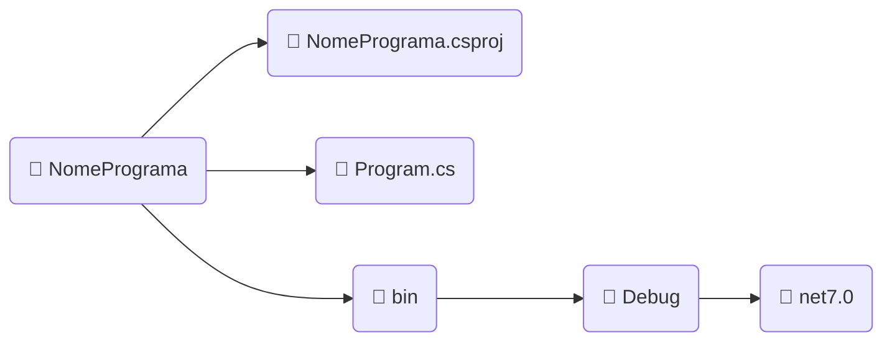
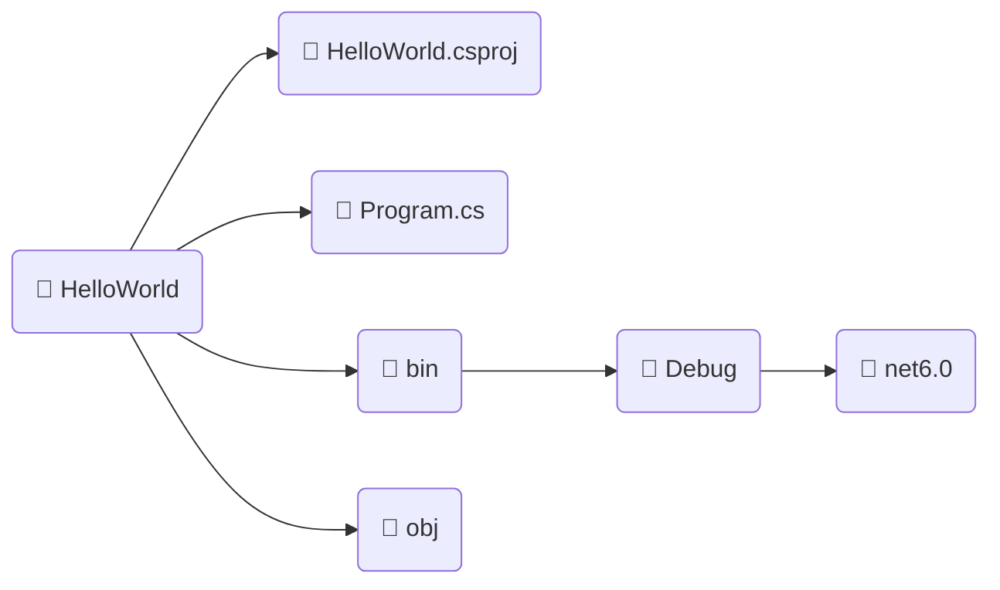

## $$\mathbb{\color{magenta}\bold{COMO \space CRIAR \space PROJETO \space CONSOLE}}$$

---

Um projeto console é um projeto simples sem interface gráfica, para poder fazer programas que podem ser rodados pelo terminal do seu sistema operacional.

Este é o tipo mais primitivo de programa que se pode fazer com .NET, e serve principalmente para programas simples na linguagem C#

---

Rode o seguinte comando dentro de um diretório

```powershell
dotnet new console -n NomePrograma
```

Este comando vai criar um novo diretório com o nome `NomePrograma` e dentro dele vai ter os seguintes arquivos.



* $\color{magenta}\sf NomePrograma.csproj$ : Este é o arquivo de projeto do C# (**cs**harp **proj**ect) onde ficam as configurações e dependências para o projeto.
* $\color{magenta}\sf Program.cs$ : Este é o arquivo (incialmente começa com o nome Program, mas pode ser renomeado) onde iremos colocar nosso código C#.
* $\color{lightgreen}\sf bin/Debug/net7.0$ : É um diretório com os binários do programa, com arquivos necessários para o processo de tradução do programa para ser compilado.

---

## Compilando o projeto

Dentro do diretório criado chamado `NomePrograma` com o projeto e o arquivo C# deve ser rodado o seguinte comando:

```powershell
dotnet run
```

Com esse comando ele vai compilar o arquivo `Program.cs` e apresentar no console o resultado do programa.

Além disso ele vai criar um diretório chamado  $\color{magenta}\sf obj$ com os arquivos da compilação feita pelo .NET.

No Fim o Projeto vai ficar estruturado da seguinte forma:



Esta é a estrutura básica de um programa do tipo console gerado pelo .NET para compilarmos programas em C#.

