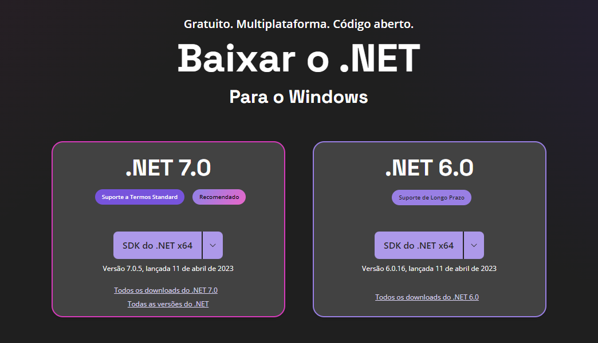

# Instalação .NET

---

## Sites para Download e Documentação

---

- Para fazer Download: [Baixar .NET (Linux, macOS e Windows) (microsoft.com)](https://dotnet.microsoft.com/pt-br/download)
- Comunidade: [Comunidade de desenvolvedores do .NET](https://dotnet.microsoft.com/pt-br/platform/community)
- Documentação do .NET: [Documentação do .NET | Microsoft Learn](https://learn.microsoft.com/pt-br/dotnet/fundamentals/)

## Como instalar

---

- Escolha a versão do .NET desejado, eu utilizo a .NET 6

- Abra o programa executável e selecione `Instalar`

- Espere concluir o Download

- Após finalizar, a instalação foi concluida!

